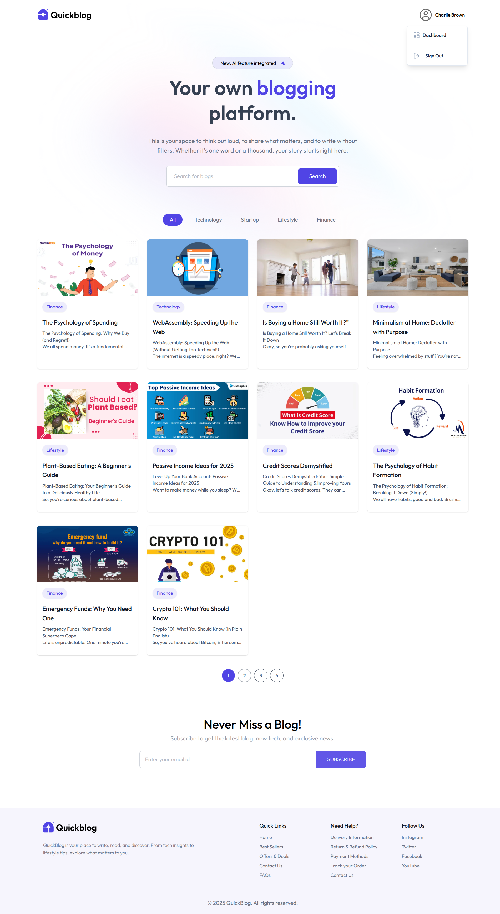
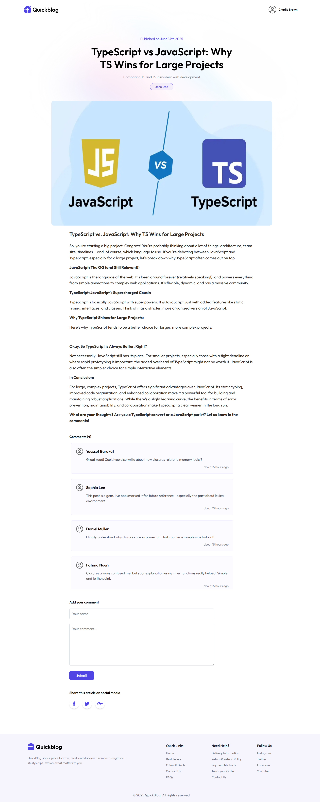
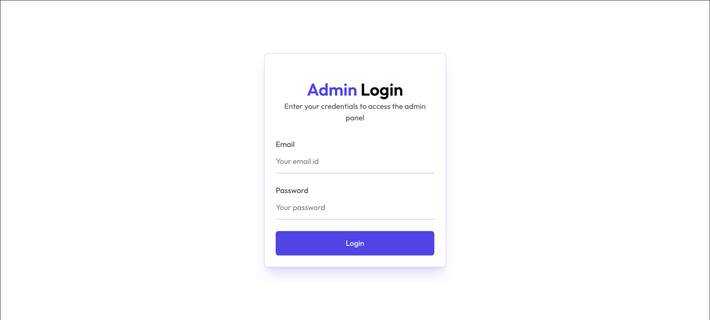
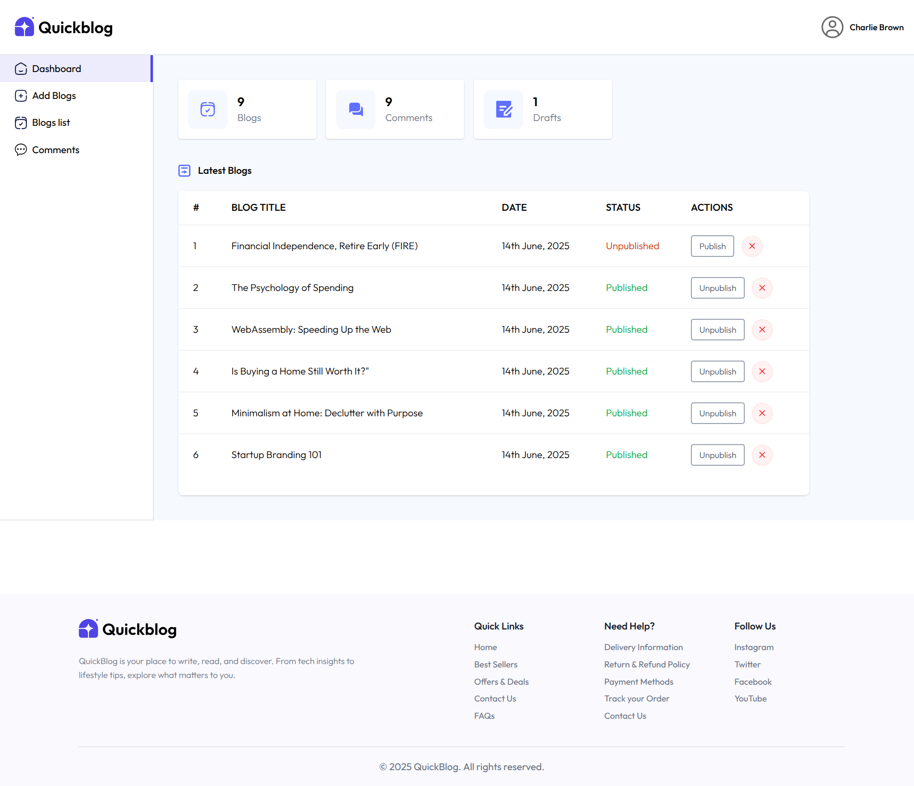
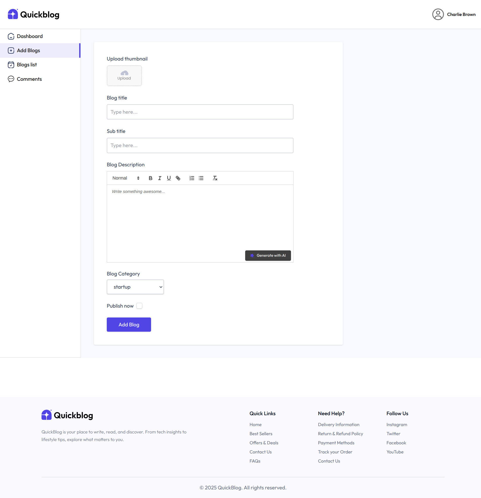
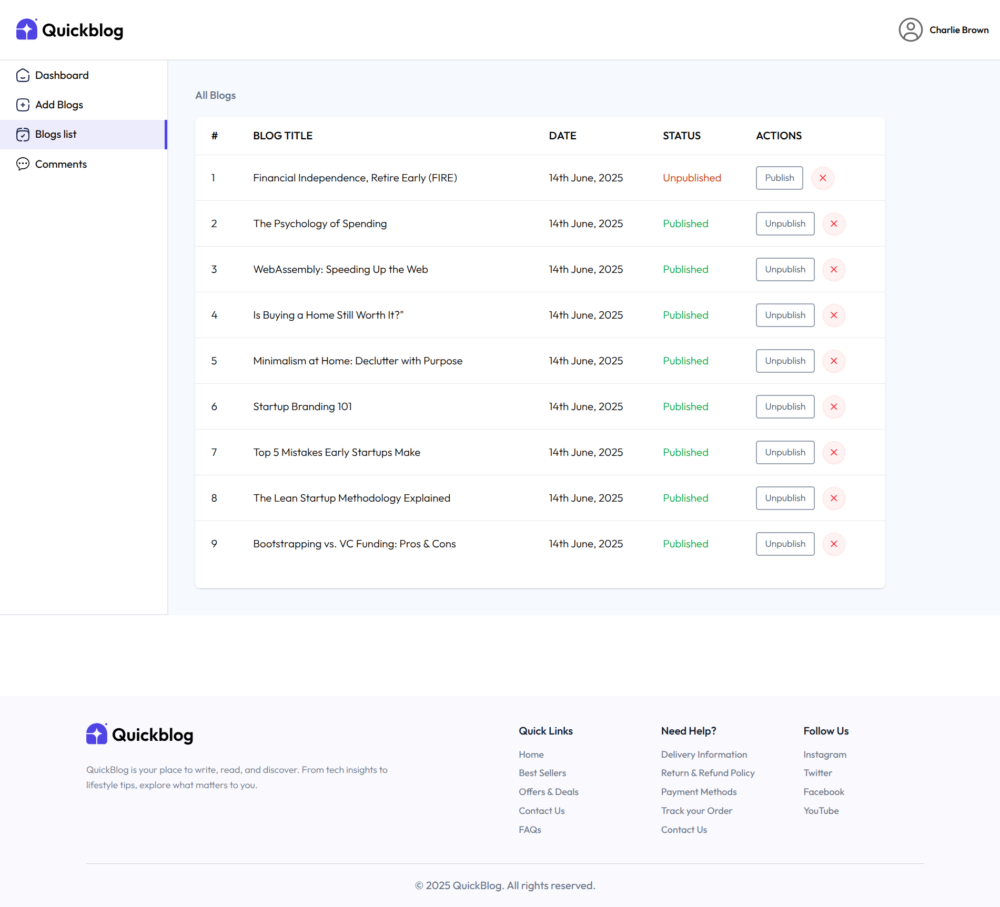
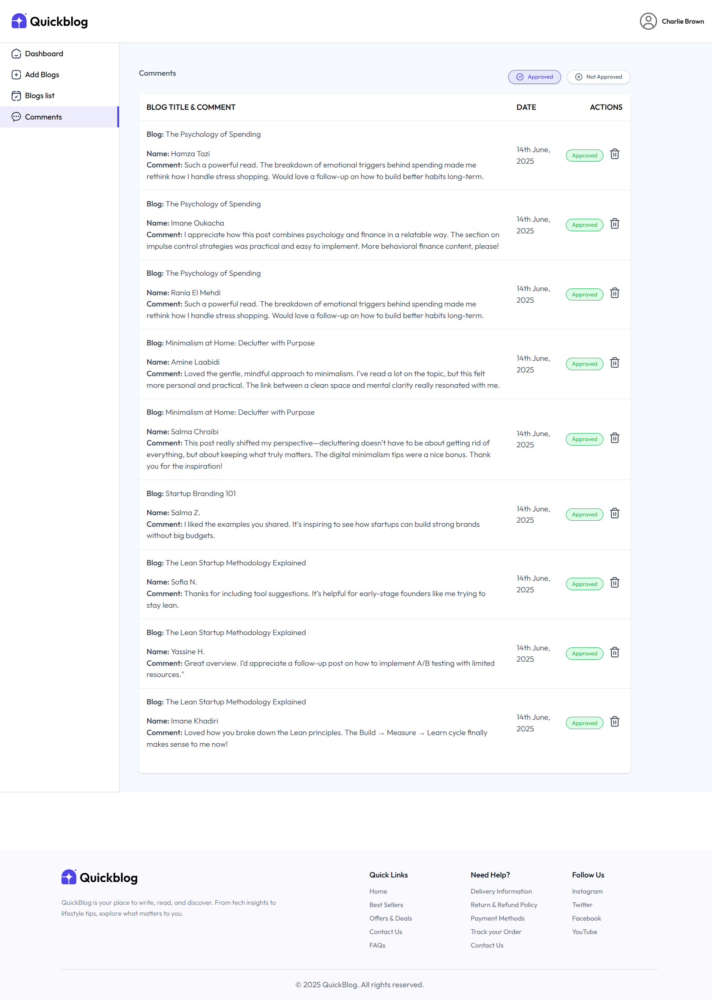

# 🚀 Quick Blog


**Quick Blog** is a modern full-stack blogging platform built with the MERN stack and TypeScript. It offers a rich, user-friendly blogging experience, secure JWT-based authentication, advanced admin tools, and AI-powered automatic content generation.

---

## 🧩 Tech Stack

### Frontend

- **Framework:** React 19 + Vite
- **Routing:** React Router v7
- **Forms & Validation:** React Hook Form + Zod
- **Styling:** Tailwind CSS
- **Rich Text Editor:** Quill
- **Data Fetching & State:** TanStack React Query
- **Utilities & UI:**

  - `axios` for HTTP requests
  - `react-hot-toast` for notifications
  - `lucide-react` for icons
  - `date-fns` for date formatting
  - `motion` for animations

### Backend

- **Runtime & Framework:** Node.js with Express 5
- **Database:** MongoDB with Mongoose
- **Authentication:** Passport.js using JWT strategy
- **Image Upload:** ImageKit
- **AI Integration:** Gemini (Google GenAI)for content description generation
- **Validation:** Zod
- **Security:** Helmet, CORS, cookie-parser

---

## 📁 Project Structure

```
quick-blog/
│
├── frontend/
│   └── src/
│       ├── assets/
│       ├── components/
│       ├── constants/
│       ├── hooks/
│       ├── layouts/
│       ├── pages/
│       ├── validations/
│       └── server.ts
│
├── backend/
│   └── src/
│       ├── configs/
│       ├── controllers/
│       ├── middlewares/
│       ├── models/
│       ├── routes/
│       ├── validations/
│       ├── App.tsx
│       └── main.tsx
│
└── README.md
```

---

## 📦 Frontend Scripts

```bash
npm run dev       # Start development server
npm run build     # Build production-ready app
npm run preview   # Preview production build
npm run lint      # Run ESLint checks
```

---

## 🧪 Backend Scripts

```bash
npm run dev       # Start development server with hot reload
npm run build     # Build for production
npm run start     # Start production server
```

---

## 🔐 Protected Admin Routes

- `/admin` — Admin dashboard with stats and latest blogs
- `/admin/blogs` — Manage existing blogs
- `/admin/blogs/new` — Create a new blog post
- `/admin/comments` — Moderate comments

> These routes are secured by the `ProtectedRoute` and `PersistLogin` React components.

---

## ✨ Features

- 📚 Browse and read paginated blogs by category or search by title
- ✍️ Create and edit blog posts with a rich Quill editor
- 🧠 AI-powered description generation using Google GenAI
- 🔒 JWT-based authentication with persistent login
- 📸 Upload and manage images via ImageKit
- 📬 Subscribe to newsletters directly from the homepage
- ⚙️ Admin dashboard with comprehensive stats and management tools

---

## 🔧 Environment Variables

Create `.env` files inside both `frontend/` and `backend/` directories.

### Frontend `.env` example

```
VITE_BASE_URL=http://localhost:5000/api/v1
```

### Backend `.env` example

```
PORT=5000
NODE_ENV=development
MONGO_URI=mongodb+srv://<USERNAME>:<PASSWORD>@cluster0.yh0fm.mongodb.net/quickBlog?retryWrites=true&w=majority&appName=Cluster0
FRONTEND_URI=http://localhost:5173
JWT_SECRET=your_jwt_secret_here
REFRESH_SECRET=your_refresh_secret_here
IMAGEKIT_PUBLIC_KEY=your_public_key
IMAGEKIT_PRIVATE_KEY=your_private_key
IMAGEKIT_URL_ENDPOINT=https://ik.imagekit.io/your_imagekit_id
GEMINI_API_KEY=your_gemini_api_key
```

---

## 🛠 Setup Instructions

1. **Clone the repository**

```bash
git clone https://github.com/Bilalben23/ai-powered-blog.git
cd ai-powered-blog
```

2. **Install dependencies**

```bash
cd frontend && npm install
cd ../backend && npm install
```

3. **Configure environment variables** as described above.

4. **Start development servers**

```bash
cd backend && npm run dev
cd frontend && npm run dev
```

---

## 🚀 Demo

Live demo for the app will be available soon!

> 🌐 **Visit:** [https://quickblog.vercel.app](https://quickblog.vercel.app) _(coming soon)_

- ## 🖼️ Screenshots

Here are some snapshots showcasing the key pages and features of **Quick Blog**, including the public interface and the admin dashboard. These images illustrate the clean UI, blog management capabilities, and moderation tools built into the platform.

### 🏠 Home Page



### 📝 Blog Page



### 🔐 Admin Login Page



### 📊 Admin Dashboard

#### 📈 Dashboard Stats



#### ➕ Add Blog



#### 📋 Blog List



#### 💬 Comments List


